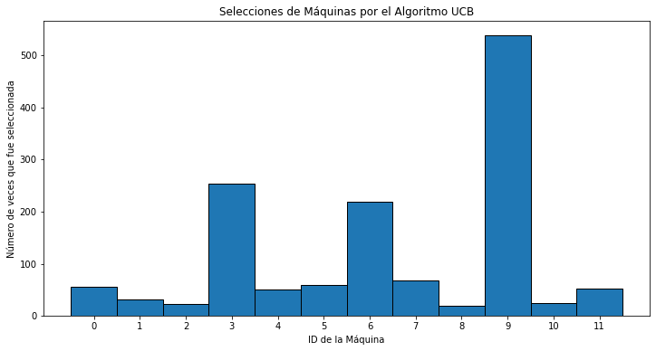
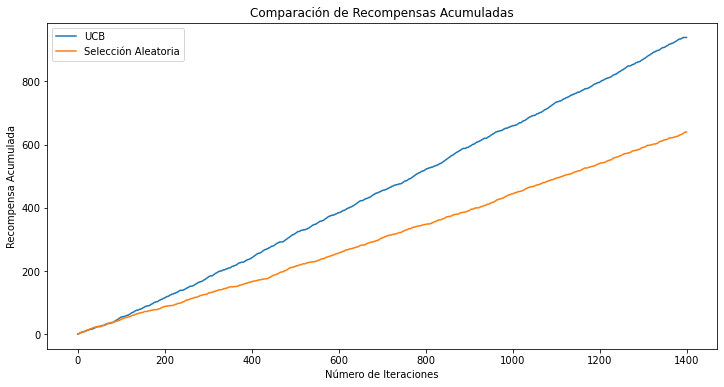

# Optimización de Máquinas Tragamonedas con el Algoritmo Upper Confidence Bound (UCB)

## Tabla de Contenidos

1. [Descripción del Proyecto](#descripción-del-proyecto)
2. [Estructura del Proyecto](#estructura-del-proyecto)
3. [Requisitos](#requisitos)
4. [Instalación](#instalación)
5. [Generación del Dataset](#generación-del-dataset)
6. [Implementación del Algoritmo UCB](#implementación-del-algoritmo-ucb)
7. [Resultados y Análisis](#resultados-y-análisis)
8. [Conclusión](#conclusión)
9. [Referencias](#licencia)

---

## Descripción del Proyecto

Este proyecto tiene como objetivo simular y optimizar la selección de máquinas tragamonedas utilizando el **Algoritmo Upper Confidence Bound (UCB)**, una estrategia efectiva para resolver problemas de **bandido multi-brazo**. A través de la generación de un dataset aleatorio y la implementación del algoritmo UCB, se busca maximizar la recompensa total acumulada al seleccionar de manera inteligente las máquinas tragamonedas más rentables.

---

## Estructura del Proyecto

El proyecto consta de los siguientes archivos:

- `generar_dataset.py`: Script para generar un dataset aleatorio que simula 12 máquinas tragamonedas evaluadas 1400 veces.
- `ucb_maquinas_tragamonedas.py`: Script que implementa el algoritmo UCB para optimizar la selección de máquinas basándose en el dataset generado.
- `maquinas_tragamonedas.csv`: Archivo CSV generado por `generar_dataset.py`.

---

## Requisitos

- - **Python 3.8+ y spyther**

### Librerías de Python
- `numpy`
- `pandas`
- `matplotlib`


## Instalación

1. **Clonar el Repositorio**
   ```bash
   git clone https://github.com/moises60/Upper-Confidence-Bound-python.git
   ```

## Generación del Dataset

El primer paso es generar un dataset que simule el comportamiento de 12 máquinas tragamonedas evaluadas 1400 veces. Este dataset almacenará los resultados de cada jugada, indicando si se obtuvo una recompensa (`1`) o no (`0`) para cada máquina.
- **Generación de Probabilidades Reales:** Cada máquina tiene una probabilidad única de otorgar una recompensa, generada aleatoriamente entre 0 y 1.
- **Simulación de Jugadas:** Para cada máquina, se simulan 1400 jugadas donde el resultado es `1` (recompensa) o `0` (sin recompensa) basado en su probabilidad.
- **Almacenamiento del Dataset:** Los resultados se almacenan en un archivo CSV llamado `maquinas_tragamonedas.csv`.

## Implementación del Algoritmo UCB

El algoritmo **Upper Confidence Bound (UCB)** se utiliza para equilibrar la exploración y la explotación en la selección de máquinas tragamonedas, buscando maximizar la recompensa total acumulada.


   - **N:** Número total de iteraciones (1400 jugadas).
   - **d:** Número de máquinas tragamonedas (12).
   - **number_of_selections:** Lista para contar cuántas veces se ha seleccionado cada máquina.
   - **sums_of_rewards:** Lista para acumular las recompensas obtenidas por cada máquina.
   - **machines_selected:** Lista para registrar qué máquina fue seleccionada en cada iteración.
   - **total_reward:** Variable para almacenar la recompensa total acumulada.
   - **rewards_matrix:** Matriz para registrar las recompensas obtenidas por cada máquina en cada iteración.


## Resultados y Análisis

Después de ejecutar el script `ucb_maquinas_tragamonedas.py`, se obtienen varios gráficos que permiten analizar el desempeño del algoritmo UCB en comparación con una estrategia de selección aleatoria.

### **1. Histograma de Selecciones de Máquinas por UCB**



- **Máquinas Más Seleccionadas:** La máquina más utilizada fue la **Máquina 9**, seguida por la **Máquina 6** y la **Máquina 3**.
- **Distribución de Selecciones:** Las máquinas con mayores tasas de recompensa fueron seleccionadas con mayor frecuencia, lo que indica que el algoritmo UCB identificó correctamente las máquinas más rentables.


### **2. Comparación de Recompensas Acumuladas (UCB vs. Selección Aleatoria)**


- **Superioridad del UCB:** La curva de recompensa acumulada para UCB es notablemente más empinada que la de la selección aleatoria, demostrando que UCB es más eficaz para maximizar las recompensas.
- **Eficiencia del Aprendizaje:** UCB logra identificar y explotar rápidamente las máquinas más rentables, mientras que la selección aleatoria distribuye las jugadas de manera uniforme, lo que resulta en una menor recompensa total.

### **3. Evolución de las Recompensas Acumuladas por Máquina**



- **Máquinas Rentables:** Las máquinas **9**, **6** y **3** muestran un crecimiento constante y acelerado en sus recompensas acumuladas, lo que confirma que son las más rentables.
- **Balance de Exploración y Explotación:** El gráfico demuestra cómo el algoritmo UCB explora diferentes máquinas inicialmente y, posteriormente, se enfoca en las más rentables, equilibrando efectivamente exploración y explotación.

## Conclusión

- **Identificar y Priorizar Máquinas Rentables:** UCB ha seleccionado predominantemente las máquinas que ofrecen mayores tasas de recompensa, como la **Máquina 9**.
- **Maximizar Recompensas Totales:** Comparado con una estrategia de selección aleatoria, UCB ha acumulado una mayor cantidad de recompensas en menos iteraciones.
- **Equilibrar Exploración y Explotación:** El algoritmo ha explorado inicialmente diversas máquinas y, con el tiempo, se ha centrado en las más rentables, demostrando una eficiente gestión del balance entre exploración y explotación.

---

## Referencias
Parte de el código se inspira en el siguiente repositorio: https://github.com/joanby/machinelearning-az/tree/master/original/Part%206%20-%20Reinforcement%20Learning/Section%2032%20-%20Upper%20Confidence%20Bound%20(UCB) 
